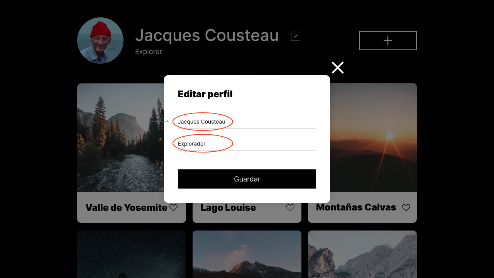
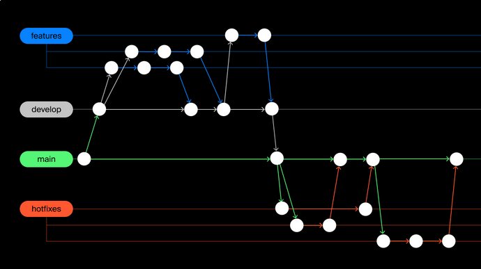
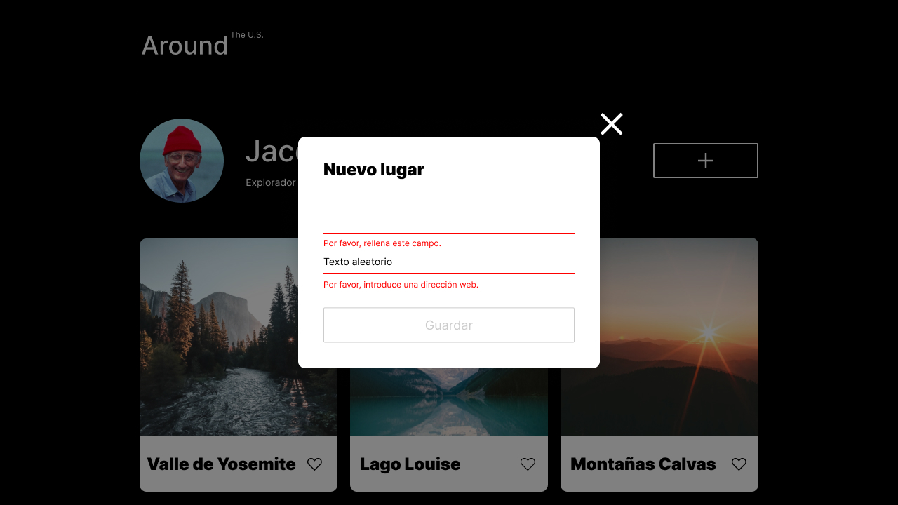

# Tripleten web_project_around

## Descripción:

Esté proyecto representa algunos de los lugares turisticos mas increibles de Estados Unidos, también incluye una galeria interactiva de los lugares y un perfil modificable a travez de un formulario.

Este será el primer proyecto que se le implementará Javascript, para ello se va a programar un cuadro emergente, Que se abra y cierre mediante eventos de javascript. Este cuadro mostrara un formulario que permita editar los datos del perfil. Lo más importante de esto, es que los cambios deben reflejarse en la página.

Por otra parte, el desarrollo de componentes se lo llevara a cabo de una manera más profesional utilizando ramas de git.

### Imagen del diseño del proyecto llamado "Alrededor de los EE.UU":

## Funcionalidad:

El objetivo de dicho proyecto es desarrollar una página interactiva en la que los usuarios pueden añadir, eliminar o dar "me gusta" a las fotos de una galeria de lugares turisticos. Todo esto mediante el uso de formularios modales emergentes que se despliegan con ayuda de codigo Javascript.

- El diseño es responsivo: la anchura del área de contenido debe cambiar en función de la anchura de la ventana del navegador.
- El ancho mínimo de la ventana es de 320px (una tarjeta en una fila).
- El ancho máximo de la ventana es de 1280px (tres tarjetas en una fila).
- Un cuadro emergente "Editar perfil" que debe mostrarse una vez que el usuario haga clic en el botón "Editar", y ocultarse al hacer clic en el botón de cierre de la esquina superior derecha.
- El formulario emergente debe permitir editar el nombre y el trabajo al que se dedica la persona del perfil y reflejar los cambios en la pagina.

### Imagen del formulario emergente para editar el perfil:

## Técnicas:

Se tomo como base los diseños de las distintas resoluciones del editor gráfico FIGMA para poder obtener las medidas, tipo de fuente y colores, para el posicionamiento se utilizó flexbox y utilizando medidas relativas para el padding y margin asi como tambien @media queries. Lo anterior es para lograr que los elementos se estiren y se encojan a conveniencia sin que los elementos se rompan cuando el ancho de la vista cambie, por ejemplo cuando la página se abre en un dispositivo móvil.

### Tecnicas aplicadas en la galeria interactiva:

1. Se trabajara con Javascript, para la creacion de eventos y para la lectura y escritura de elementos en el marcado HTML. Se controlara el contenido con las propiedades innerHTML y textContent.

2. Se implemantarán consultas de medios (mediaqueris) para que evitar desplazamientos y controlar puntos de quiebre del diseño.

3. Se trabajará con propiedades como text-overflow y white-space para implementar desbordamientos en bloques de texto con una elipsis insertada al final.

### Esquema de ramas de git aplicadas en el desarrollo:

1. La rama Features representá cada componente del sitio web, es decir se crearán ramas independientes, por ejemplo en la subrama feature/header se desarrollara el encabezado de la pagina.

2. La rama Develop es la rama principal de trabajo, dentro de ella se fusionarán las ramas features con el fin de llevar a cabo depuraciones y probar las nuevas caracteristicas sin correr el riesgo de afectar la rama de desarrollo principal. Al final de todo se fusiona con la rama main.

3. La rama Hotfix se utilizá para la corrección de errores, por ejemplo el header esta incompleto se crea una rama hotfix/header, y una vez solucionados los errores se fusionan nuevamente con main y despues se eliminan.

### Cosas aprendidas en la primera parte:

1.  Fundamentos basicos de Javascript: Aprendi las cosas basicas de este lenguaje como: variables, funciones, addEventListeners y modales emergentes; Asi como tambien a seleccionar y controlar el contenido de los elementos de HTML con propiedades como: querySelector, innerHTML y textContent. Esto me permitió reaccionar a las acciones del usuario y actualizar la interfaz de forma dinámica.

2.  Manipulación del DOM: Trabaje con el DOM (Document Object Model) para poder acceder y modificar los elementos HTML de mi página web de manera programática. Esto me dio la habilidad de cambiar contenido, agregar o quitar elementos, y modificar estilos en tiempo real para asi poder crear una experiencia más personalizada para el usuario.

3.  Uso de Git y ramas: Aprendi a trabajar profesionalmente con Git, creando ramas para cada componente del proyecto. Esto me permitió organizar mejor mi trabajo y tener la capacidad de colaborar eficientemente con un equipo, ya que podía hacer cambios en diferentes partes del proyecto sin interferir con el código principal. Además, al fusionar las ramas, aprendi a manejar errores, bugs, y asegurarme de que todo se integre correctamente.

## Segunda Parte

La segunda entrega del proyecto se enfoca en la funcionalidad de la pagina, en donde se aplican muchas mas tecnicas y metodos de programacion de Javascript.

### Funcionalidades agregadas:

- Cuando se carga la página, deberían aparecer seis tarjetas automaticamente mediante JavaScript.
- Un nuevo formulario emergente que para agregar una nueva tarjeta a la galeria.
- Programa el botón de "Me gusta" en las tarjetas, si el usuario hace clic en el, el corazón alterna su color entre blanco y negro.
- Agregar el boton trash para remover una tarjeta de la galeria.
- Al seleccionar una imágen, esta deberá aparecer como cuadro emergente, es decir, al hacer click dicha imágen se expandira junto a su respectivo nombre y se ajustara su tamaño dependiendo la resolución del dispositivo.

### Imagen del diseño de los cuadros emergentes:

### Cosas aprendidas en la segunda parte:

1. Adquirí un mejor entendimiento sobre el lenguaje Javascript y la lógica de los arrays, especialmente en lo que respecta al manejo de sus objetos y propiedades.

2. Aprendí a utilizar la etiqueta template y nodos para implementar varias funciones que facilitaron la interacción con los elementos html, como su creación y eliminación.

3. Aprendí a resolver conflictos entre ramas en un proyecto, simulando intencionalmente un error, y utilizando VSCODE para solucionarlo eficientemente.

## Tercera Parte

En la tercera entrega del proyecto se requiere validar todos los formularios del proyecto y mejorar la experiencia del usuario en cuanto a las ventanas emergentes, aplicando mas tecnicas y metodos de programacion de Javascript.

### Funcionalidades agregadas:

- Validar el formulario "Editar perfil" mediante JavaScript. Si un campo no pasa la validación, debajo de este campo debe aparecer un mensaje de error personalizado de color rojo utilizando los mensajes de error por defecto del navegador y el boton de envio se debe deshabilitar.
- Validar del formulario "Nuevo lugar", de igual forma con el mensaje de error y el envio deshabilitado.
- Programar una función que permita a los usuarios cerrar cualquiera de las ventanas emergentes haciendo clic en la superposición, es decir, en cualquier lugar fuera de los bordes de la ventana emergente.
- Programar una función que permita a los usuarios cerrar la ventana emergente pulsando la tecla Esc.

### Imagen de la validacion de los formularios:

### Cosas aprendidas en la tercera parte:

1. Adquirí un mejor entendimiento sobre como conectar los métodos de validación como detectores y controladores de JavaScript con el DOM.

2. Aprendí varias técnicas de interacción con el usuario para mejorar la experiencia de uso al incorporar la validacion de campos en tiempo real.

3. He aprendido a controlar los eventos del teclado y del ratón, las técnicas de propagación y delegación de eventos asi como tambien, la la forma de utilizarlas para mantener un código estructurado y ordenado.

## Cuarta Parte

En la cuarta entrega del proyecto se debe aplicar la Programación Orientada a Objetos (POO) para desarrollar y agregar clases al proyecto mediante Javascript. Durante esta fase, se llevara a cabo una refactorización del código, lo que implica sustituir una gran parte del código anterior con el contenido de las nuevas clases. Además, el proyecto se reorganizara en módulos utilizando las sentencias de export e import.

### Funcionalidades agregadas:

-El primer requisito es agregar las clases Card y FormValidator al código y asegurarte de que cada una de ellas realiza una tarea específica. Estas clases deben contener todo el código necesario para realizar sus respectivas tareas.

-El segundo requisito es dividir el código JavaScript en módulos. El proyecto incluirá cuatro scripts:

    1. Card.js contendrá el código de la clase Card.
    2. FormValidator.js contendrá el código de la clase FormValidator.
    3. utils.js contendrá los controladores de eventos y la función que abre/cierra las ventanas modales.
    4. El archivo index.js contendrá el resto del código (nos referimos a este archivo tanto como index.js o como script.js son que convenciones de nomenclatura comunes para el archivo de script principal).

- Las clases Card y FormValidator deben ser exportadas desde sus archivos correspondientes, y luego se debe importarlas e implementarlas dentro de index.js.
- Asegúrate de que los archivos JS están conectados a index.html como módulos con type="module".

### Cosas aprendidas en la cuarta parte:

1. Aprendi cómo utilizar la Programación Orientada a Objetos para estructurar el código mediante clases.

2. Comprendi la importancia de la refactorización para mejorar la organización y eficiencia del código.

3. Entendi la manera en que los módulos permiten dividir el código en partes reutilizables y conectarlas con export e import.

## Técnologías utilizadas:

&nbsp;
&nbsp;
&nbsp;
&nbsp;
&nbsp;

---

## Enlace a la Página de GitHub:

https://leo2434.github.io/web_project_around/
